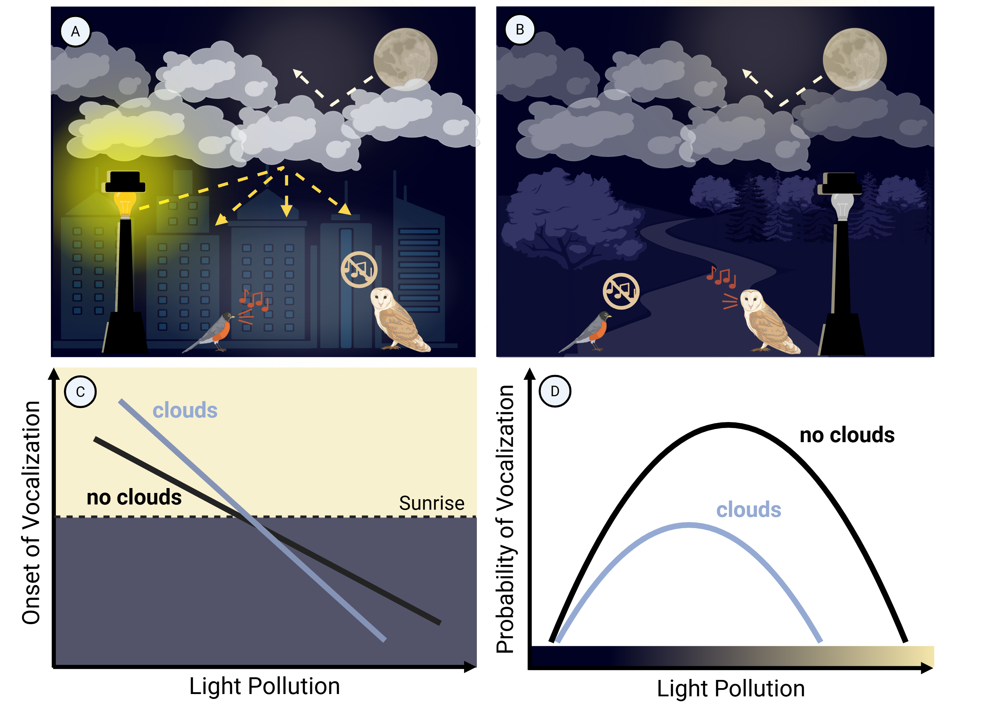

# Clouds modulate light-pollution effects on avian behavior

[Karina M. Torres](https://ktorres23.github.io/), Vimukthi Gunasekera, Katherine M. Godfrey, Isaac T. Grosner, Bailey P. McLaughlin, Lauren R. Benedict, Lucy J. Cheeley, Kaidan W. Capossere, Haley Holiman, Katherine C. Gurin, Claire A. Witthuhn, Chloe Sweet, [Brent S. Pease](https://peaselab.com/), [Neil A. Gilbert](https://www.gilbertecology.com/)*

*Corresponding author

## Abstract

[*This is the abstract placeholder*]

## Repository Directory

* [`data`](#data) Directory containing data, results, and figures; [organized by Levels (L0-L3)](repo_management_guide.md)
* [`misc`](#misc) Directory containing miscellaneous scripts and data
* [`scripts`](#scripts) Directory containing scripts; [organized by Levels (L0-L3)](repo_management_guide.md)
* [`.gitignore`](.gitignore) Files to ignore for Git commits
* [`LICENSE`](LICENSE) Licensing rights
* [`figure1_nocaptions_V06.png`](figure1_nocaptions_V06.png) Conceptual figure
* [`README.md`](README.md)
* [`repo_management_guide.md`](repo_management_guide.md) Guide to working in the [birdclouds](#birdclouds) repo

### [`Data`](data)

* `viirs_unzipped/...` Directory containing raw VIIRS data: cloud-free VIIRS Day Night Band data, publicly available for download from the [Earth Observation Group](https://eogdata.mines.edu/products/vnl/). We did not include the raw data due to the size of the dataset.

#### [`data/L0`](data/L0)

* [`stations_mar2026.csv`](data/L0/stations_mar2026.csv) List of BirdWeather stations extracted from the raw BirdWeather data for the study period. Each station was assigned a unique ID number (station_id), and the list also contains the longitude and latitude coordinates of each station.

The following data from the [`data/L0`](data/L0) directory was not included in the repository due to file size limits:

* `MODCF_mean.tif` Mean annual cloud cover dataset downloaded from [EarthEnv](https://www.earthenv.org/cloud) [(Wilson & Jetz, 2016)](https://doi.org/10.1371/journal.pbio.1002415).
* `activity_measures/...` Directory containing diurnal and nocturnal activity measures. **NOTE:** both activity measure calculations and raw BirdWeather data files were too large to include in this directory, but are available for download at: [BirdWeather Data Explorer](https://app.birdweather.com/data).
  * `activity_measures/diurnal` Directory containing diurnal activity measures, created in script [`001_data_prep_calculate_diurnal_vocal_activity.R`](scripts\L0\001_data_prep_calculate_diurnal_vocal_activity.R)
  * `activity_measures/nocturnal` Directory containing nocturnal activity measures, created in script [`002_data_prep_calculate_nocturnal_vocal_activity.R`](scripts\L0\002_data_prep_calculate_nocturnal_vocal_activity.R)

#### [`data/L1`](data/L1)

* [`101_stations_with_VIIRS_2026_03_06.csv`](data\L1\101_stations_with_VIIRS_2026_03_06.csv) BirdWeather stations with VIIRS data spatiotemporally joined
* [`105_station_date_elev_buffer.Rdata`](data\L1\105_station_date_elev_buffer.Rdata) BirdWeather stations with study period dates and elevation data 
* [`108a_night_ids`](data\L1\108a_night_ids.RData) Nocturnal data with distinct BirdWeather stations and IDs for night periods
* [`logs/log_station_batches.txt`](data\L1\logs\log_station_batches.txt) Log file outputted from extracting data from the Open-Meteo API in script [`103_openmeteo_fetch_data.R`](scripts\L1\103_openmeteo_fetch_data.R)
* [`station_batches/...`](data\L1\station_batches) Directory of batches of unique BirdWeather station IDs from script [`102_create_station_dir.R`](scripts\L1\102_create_station_dir.R)

The following intemediate data from the [`data/L1`](data/L1) directory was not included in the repository due to file size limits:

* `107_openmeteo_summarized_batches_diurnal/...` Directory of summarized Open-Meteo data batches for diurnal vocalization data
* `108b_openmeteo_summarized_batches_nocturnal/...` Directory of summarized Open-Meteo data batches for nocturnal vocalization data
* `109_moon_summarized_batches/...` Directory of summarized moonlight data batches for nocturnal vocalization data
* `completed_batches/...` Directory of successful batched extraction of raw weather data from the Open-Meteo API
* `completed_batches_buffer/...` Directory of successful batched extraction of raw moonlight data from the MoonShineR package
* `updated_batches/...` Directory of updated station IDs from the successful batched extraction of raw weather data from the Open-Meteo API
* `updated_batches_buffer/...` Directory of updated station IDs from the successful batched extraction of raw moonlight data from the MoonShineR package

#### [`data/L2`](data/L2)

* [`final_data_metadata.md`](data\L2\final_data_metadata.md) Contains metadata describing the variables and units for each column in the diurnal and nocturnal vocalization datasets used prior to modelling prep in [`data/L3`](data/L3).

The following intemediate data from the [`data/L2`](data/L2) directory was not included in the repository due to file size limits:

* `activity_measures_diurnal.RData` Diurnal vocalization metrics (onset and cessation) with filtering (BirdNet confidence >0.75 with >= 100 detections for a species per station-date)
* `activity_measures_nocturnal.RData` Nocturnal vocalization metrics (detection-nondetections) with filtering (BirdNet confidence >0.75 with >= 20 detections for a species per station-date)
* `final_diurnal_ev_ces.RData` Diurnal evening cessation dataset with light pollution (VIIRS) and weather (Open-Meteo) covariates spatiotemporally joined
* `final_diurnal_first_onset.RData` Diurnal first onset dataset with light pollution (VIIRS) and weather (Open-Meteo) covariates spatiotemporally joined
* `final_nocturnal.RData` Nocturnal detection-nondetection dataset with light pollution (VIIRS) and weather (Open-Meteo) covariates spatiotemporally joined
* `stations_with_VIIRS_2026_03_06.RData` BirdWeather stations with VIIRS data spatiotemporally joined
* `summarized_weather_data_diurnal.RData` Summarized Open-Meteo weather data for the diurnal datasets
* `summarized_weather_data_nocturnal.RData` Summarized Open-Meteo weather data for the nocturnal dataset

#### [`data/L3`](data/L3)

* [`placeholder`](placeholder)
  * [`placeholder`](placeholder)

* [`304_final_data/...`](data\L3\304_final_data) Directory of final diurnal and nocturnal datasets for modelling.
  * **Final selected datasets**
    * [`304d_diurn_on_final_50.rds`](data\L3\304_final_data\304d_diurn_on_final_50.rds) Final diurnal onset dataset with 5.0 degree grid cells
    * [`304e_diurn_ev_final_50.rds`](data\L3\304_final_data\304e_diurn_ev_final_50.rds) Final diurnal cessation dataset with 5.0 degree grid cells
    * [`304f_noc_final_50.rds`](data\L3\304_final_data\304f_noc_final_50.rds) Final nocturnal probability dataset with 5.0 degree grid cells
  * **Other datasets**
    * [`304_diurn_on_final_05_no_filter.rds`](data\L3\304_final_data\304_diurn_on_final_05_no_filter.rds) Diurnal onset dataset with 0.5 degree cells (unfiltered)
    * [`304_diurn_on_final_50_no_filter.rds`](data\L3\304_final_data\304_diurn_on_final_50_no_filter.rds) Diurnal onset dataset with 5.0 degree cells (unfiltered)
    * [`304a_diurn_on_final_05.rds`](data\L3\304_final_data\304a_diurn_on_final_05.rds) Diurnal onset dataset with 0.5 degree cells
    * [`304b_diurn_ev_final_05.rds`](data\L3\304_final_data\304b_diurn_ev_final_05.rds) Diurnal cessation dataset with 0.5 degree cells (unfiltered)
    * [`304c_noc_final_05.rds`](data\L3\304_final_data\304c_noc_final_05.rds) Nocturnal probability dataset with 0.5 degree cells
* [`305_models/...`](data/L3/305_models) Directory containing model objects and results
  * **Final selected models**
    * [`305c_mod_on_50.rds`](data/L3/305_models/305c_mod_on_50.rds) Model object for diurnal onset model with 5.0 degree grid cells
    * [`305d_mod_ev_50.rds`](data/L3/305_models/305d_mod_ev_50.rds) Model object for diurnal cessation model with 5.0 degree grid cells
    * [`305j_mod_noc_50.rds`](data/L3/305_models/305j_mod_noc_50.rds) Model object for nocturnal probability model with 5.0 degree grid cells
    * [`305c_mod_on_50_RESULTS.txt`](data/L3/305_models/305c_mod_on_50_RESULTS.txt) Raw model output for diurnal onset model with 5.0 degree grid cells
    * [`305d_mod_ev_50_RESULTS.txt`](data/L3/305_models/305d_mod_ev_50_RESULTS.txt) Raw model output for diurnal cessation model with 5.0 degree grid cells
    * [`305j_mod_noc_50_RESULTS.txt`](data/L3/305_models/305j_mod_noc_50_RESULTS.txt) Raw model output for nocturnal probability model with 5.0 degree grid cells
  * **Other models**
    * *Not included due to file size limits*
* [`306_fig3/...`](data/L3/306_fig3) Directory containing data and Figure 3
  * [`306a_pred_on.rds`](data\L3\306_fig3\306a_pred_on.rds) Predicted values for the diurnal onset response variable to support figure 3 visualizations
  * [`306b_pred_ev.rds`](data\L3\306_fig3\306b_pred_ev.rds) Predicted values for the diurnal cessation response variable to support figure 3 visualizations
  * [`306c_pred_noc.rds`](data\L3\306_fig3\306c_pred_noc.rds) Predicted values for the nocturnal probability response variable to support figure 3 visualizations
  * [`306d_Fig3_v2.png`](data\L3\306_fig3\306d_Fig3_v2.png) Figure 3
* [`307_fig4/...`](data/L3/307_fig4) Directory containing data and Figures 4, 5, and S1-3
  * [`307_fig4_panelA.png`](data\L3\307_fig4\307_fig4_panelA.png) Figure 4 Panel A
  * [`307_fig4_panelB.png`](data\L3\307_fig4\307_fig4_panelB.png) Figure 4 Panel B
  * [`307_fig4.png`](data\L3\307_fig4\307_fig4.png) Figure 4 Combined Panels A + B
  * [`307_fig5_panelA.png`](data\L3\307_fig4\307_fig5_panelA.png) Figure 5 Panel A
  * [`307_fig5_panelB.png`](data\L3\307_fig4\307_fig5_panelB.png) Figure 5 Panel B
  * [`307_fig5.png`](data\L3\307_fig4\307_fig5.png) Figure 5 Combined Panels A + B
  * [`307_FigS1.png`](data\L3\307_fig4\307_FigS1.png) Figure S1
  * [`307_FigS2.png`](data\L3\307_fig4\307_FigS2.png) Figure S2
  * [`307_FigS3.png`](data\L3\307_fig4\307_FigS3.png) Figure S3
  * [`307a_pred_diurn_on.rds`](data/L3/307_fig4/307a_pred_diurn_on.rds) Predicted values for the diurnal onset response variable to support figure visualizations
  * [`307b_pred_diurn_ev.rds`](data/L3/307_fig4/307b_pred_diurn_ev.rds) Predicted values for the diurnal cessation response variable to support figure visualizations
  * [`307c_pred_noc.rds`](data/L3/307_fig4/307c_pred_noc.rds) Predicted values for the nocturnal probability response variable to support figure visualizations
* [`300_fig2b_world_cloud_cover_map.png`](data\L3\300_fig2b_world_cloud_cover_map.png) Global map of average cloud cover to use as element in Figure 2B
* [`308_fig2b_vocs.png`](data\L3\308_fig2b_vocs.png) Summary of vocalization data used in this study to use as element in Figure 2B

The following intemediate data from the [`data/L3`](data/L3) directory was not included in the repository due to file size limits:

* `301_elton_traits/...` Directory of diurnal and nocturnal datasets with species names resolved by EltonTraits 1.0
* `302_evaluate_stations/...` Directory of diurnal and nocturnal datasets retaining only stationary stations
* `303_grid_cells/...` Directory of diurnal and nocturnal datasets with grid cells for random effects structure
* `305_models_no_precip` Directory of diurnal models that excluded observations with precipitation events

### [`Misc`](misc)

* [`alan_paper_vocal_activity_output`](misc/alan_paper_vocal_activity_output) Onset and cessation data output from the [Pease & Gilbert, 2025](https://github.com/BrentPease1/alan); this exact dataset was not used in the birdclouds analyses
* [`exploratory`](misc/exploratory/) Exploratory data analyses
    * [`exploratory/data_tinkering`](misc/exploratory/data_tinkering) Contains scripts and data to examine questionable onset & cessation calculations from the diurnal vocal activity calculation script
    * [`exploratory/open_meteo`](misc/exploratory/open_meteo) Contains script and output data to pull and join data from [open-meteo API](https://open-meteo.com/) to Birdweather stations
* [`legacy_scripts`](misc/legacy_scripts/) Various unused code and scripts (i.e., legacy)
* [`thematic-standardization-workflow.png`](misc/thematic-standardization-workflow.png) Workflow reference figure used in the [`repo_management_guide.md`](repo_management_guide.md). Figure by the [Environmental Data Initiative](https://edirepository.org/resources/thematic-standardization)

### [`Scripts`](scripts)

#### [`scripts/L0`](scripts/L0)

* [`001_data_prep_calculate_diurnal_vocal_activity.R`](scripts\L0\001_data_prep_calculate_diurnal_vocal_activity.R) Script to calculate morning onset and evening cessation from raw BirdWeather data downloads. **NOTE:** raw BirdWeather data files were too large to include in this directory, but are available for download at: [BirdWeather Data Explorer](https://app.birdweather.com/data).
* [`002_data_prep_calculate_nocturnal_vocal_activity.R`](scripts\L0\002_data_prep_calculate_nocturnal_vocal_activity.R) Script to calculate nocturnal detection-nondetections from raw BirdWeather data downloads. **NOTE:** raw BirdWeather data files were too large to include in this directory, but are available for download at: [BirdWeather Data Explorer](https://app.birdweather.com/data).

#### [`scripts/L1`](scripts/L1)

* [`101_extract_VIIRS.R`](scripts\L1\101_extract_VIIRS.R) This script extracts monthly VIIRS data for each BirdWeather station across the study period.
* [`102_create_station_dir.R`](scripts\L1\102_create_station_dir.R) This script takes unique BirdWeather station lat/long coords and organizes them into subdirectories for batching purposes
* [`103_openmeteo_fetch_data.R`](scripts\L1\103_openmeteo_fetch_data.R) This script retrieves weather data from the Open-Meteo Historical Weather API ([Zippenfenig, 2023](https://doi.org/10.5281/ZENODO.7970649)) for each BirdWeather station, based on some batching and subdirectory logic to distribute API calls.
* [`104_openmeteo_fix_stations.R`](scripts\L1\104_openmeteo_fix_stations.R) This script fixes a station ID labelling error from script [`102_create_station_dir.R`](scripts\L1\102_create_station_dir.R) for the Open-Meteo data.
* [`105_moon_calculate_intensity.qmd`](scripts\L1\105_moon_calculate_intensity.qmd) This script gets the value of moonlight intensity data for every hour of the study period at each station using the MoonShineR package ([Poon et al., 2024](https://doi.org/10.1111/2041-210X.14299))
* [`106_moon_fix_stations.R`](scripts\L1\106_moon_fix_stations.R) This script fixes a station ID labelling error from script [`102_create_station_dir.R`](scripts\L1\102_create_station_dir.R) for the moonlight data.
* [`107_openmeteo_summarize_data_diurnal.qmd`](scripts\L1\107_openmeteo_summarize_data_diurnal.qmd) This script summarizes weather data from the Open-Meteo API for each BirdWeather station, using 3hr buffers around sunset and sunrise times across the study period
* [`108_openmeteo_summarize_data_nocturnal.qmd`](scripts\L1\108_openmeteo_summarize_data_nocturnal.qmd)
* [`109_moon_summarize_intensity.qmd`](scripts\L1\109_moon_summarize_intensity.qmd) This script summarizes weather data from the Open-Meteo API for each BirdWeather station, using nocturnal periods

#### [`scripts/L2`](scripts/L2)

* [`201_combine_data.qmd`](scripts\L2\201_combine_data.qmd) This script combines covariate datasets with vocalization activity data

#### [`scripts/L3`](scripts/L3)

* [`300_create_cloud_world_map.R`](scripts\L3\300_create_cloud_world_map.R) This script creates a world map of cloud cover for Fig 2B
* [`301_join_elton_traits.R`](scripts\L3\301_join_elton_traits.R) This script grabs Elton Traits data ([Wilman et al., 2014](https://doi.org/10.1890/13-1917.1)) to resolve species names in our avian vocalization data 
* [`302_evaluate_stations.R`](scripts\L3\302_evaluate_stations.R) This script evalutes stations to keep only stationary stations
* [`303_make_grid_cells.R`](scripts\L3\303_make_grid_cells.R) This script creates grid cells for random effects structure
* [`304_filter_grid_data_final.R`](scripts\L3\304_filter_grid_data_final.R) This script filters grid cells to include only those with a certain number of vocalizations by a quantile
* [`305a_model_diurnal.R`](scripts\L3\305a_model_diurnal.R) This script creates models for diurnal vocalization timing
* [`305b_model_nocturnal.R`](scripts\L3\305b_model_nocturnal.R) This script creates models for nocturnal vocalization probability
* [`306_visualize_fig3.R`](scripts\L3\306_visualize_fig3.R) This script visualizes Figure 3
* [`307_visualize_fig4-5.qmd`](scripts\L3\307_visualize_fig4-5.qmd) This script visualizes Figures 4, 5, and Supp Figs. 1 and 2
* [`308_summary_stats.qmd`](scripts\L3\308_summary_stats.qmd) This script puts together basic summary statistics of the data used for modelling.

